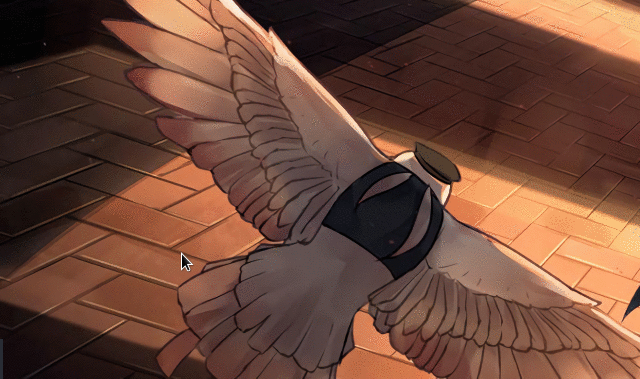
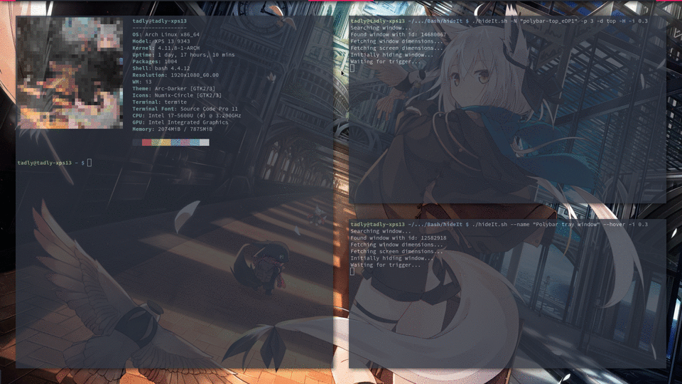
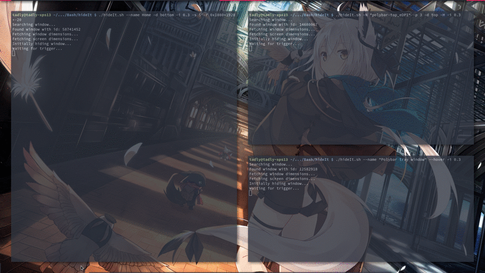

hideIt.sh
=========

`hideIt.sh` will move windows out of your screen and show them again  
when you mouse over a predefined region or the window itself.

Initially I wrote this script to imitate gnome-shells systray in combination with [polybar](https://github.com/jaagr/polybar).  
This sript however was very much bound to my environment.  

Eventually I decided it would be a great idea to share it with the unix community  
and re-wrote the whole thing, making it more generic and (hopefully) userfriendly.

## Table of Contents
 * [Requirements](#requirements)
    * [Optionally](#optionally)
 * [Usage](#usage)
 * [Examples](#examples)
    * [Polybar systray](#polybar-systray)
    * [Polybar (my main bar)](#polybar-my-main-bar)
    * [Nautilus?](#nautilus)
    * [By keyboard (SIGUSR1)](#by-keyboard-sigusr1)
 * [Q&A](#qa)


## Requirements
1. bash
2. xdotool
3. xwininfo


### Optionally
1. xprop (to find the windows name)


## Usage
You can read some help text right?
```bash
./hideIt.sh --help
```


## Examples
### Polybar systray
A standalone systray configuration could look something like this:
```ini
[bar/systray]
# As small as possible, polybar will resize it when items get added
width = 1

# Whatever fits your needs
height = 40

# Bottom left to imitate gnome-shells systray
bottom = true

# REQUIRED for us to be able to move the window
override-redirect = true

modules-right = placeholder

tray-position = left
tray-maxsize = 16
tray-padding = 8
tray-transparent = false
tray-background = #282C34

[module/placeholder]
# Just a dummy module as polybar always requires at least one amodule
type = custom/script
width = 1
```

Now lets hide it:
```bash
# Find the windows name
$ xprop | grep WM_NAME
WM_NAME(STRING) = "Polybar tray window"

# Hide it
$ ./hideIt.sh --name "Polybar tray window" --hover
```
  
*[Wallpaper](https://www.pixiv.net/member_illust.php?mode=medium&illust_id=60439088)*


### Polybar (my main bar)
You don't need my whole polybar config right? Right!  

I only did this for the purpose of testing while working on this script but...  
...I think I like it! :)  
  
*[Wallpaper](https://www.pixiv.net/member_illust.php?mode=medium&illust_id=60439088)*


### Nautilus?
Heck... why stop at the statusbar amiright?  

  
*[Wallpaper](https://www.pixiv.net/member_illust.php?mode=medium&illust_id=60439088)*

*Disclaimer: Yes, I know, this is getting silly but I gotta demonstrate how versatile this is* ( ͡° ͜ʖ ͡°)


### By keyboard (SIGUSR1)
Instead of using your mouse to trigger the show/hide event, you can also send a `SIGUSR1` to the process.  
For this to work, the process needs to be started using the `-S, --signal` argument.  

This will than **ignore** the mouse completely and only listen for `SIGUSR1` at which it will either show or hide the window.  

For example:
```bash
$ ./hideIt.sh --name drop-down-terminal --signal
```

To send a `SIGUSR1`-signal you can use `hideIt.sh` itself:
```bash
$ ./hideIt.sh --name drop-down-terminal --toggle
```

or use plain old `kill` itself:
```bash
$ kill -SIGUSR1 <pid>
```

## Q&A
#### *How does the script determine when to trigger?*  
Sadly via polling (hence the `--interval` switch).  
I tried xdotools `behave_screen_edge` but weird things came from it so I decided on the polling-route.  
I've tried my best to keep the cpu usage down though!
